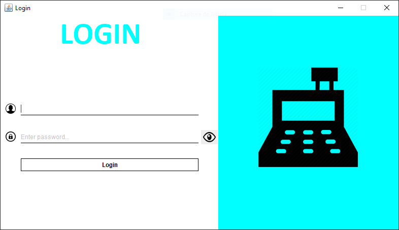
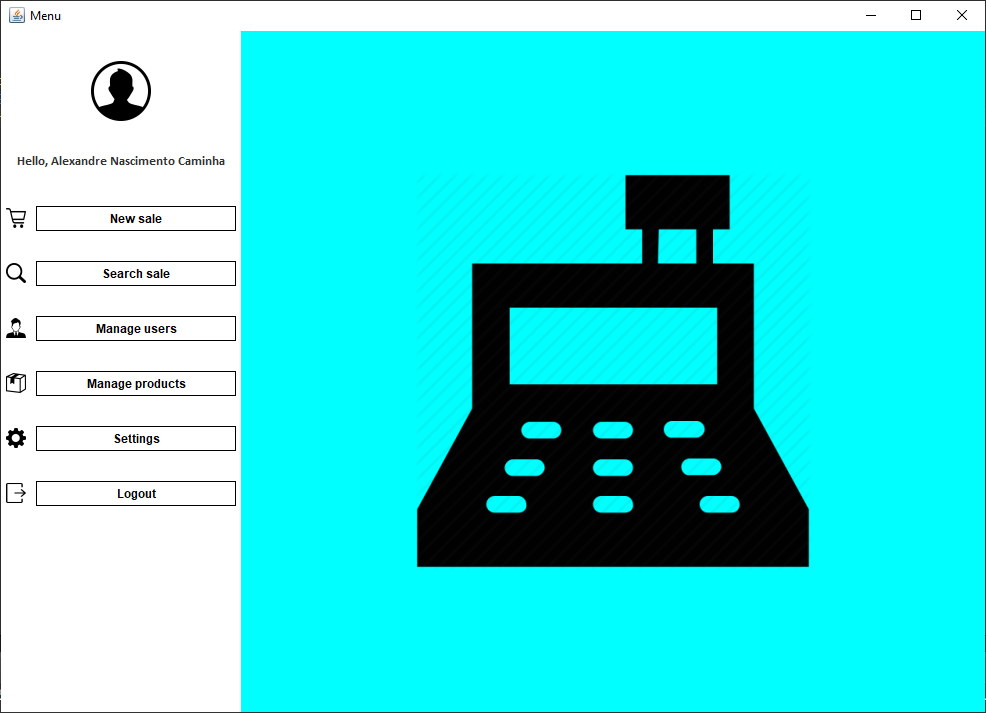
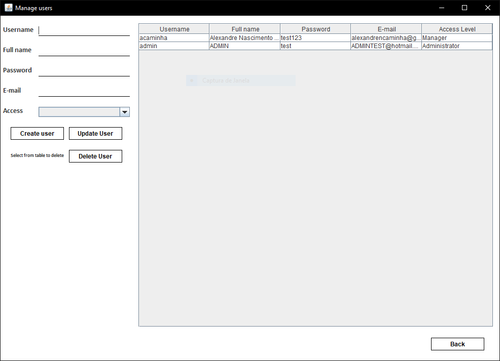
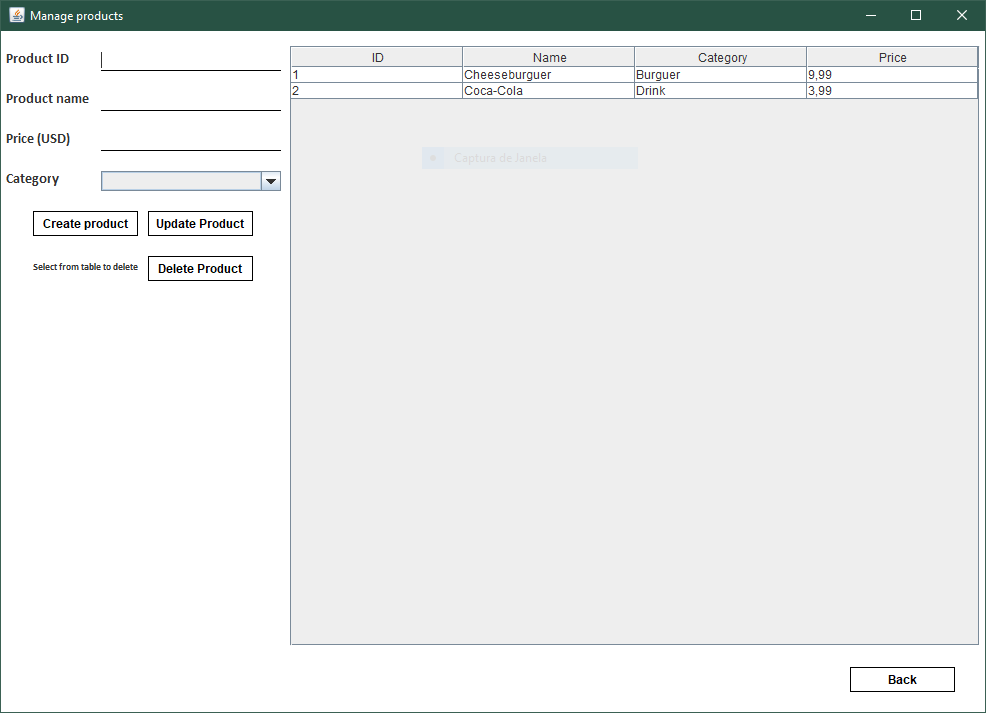
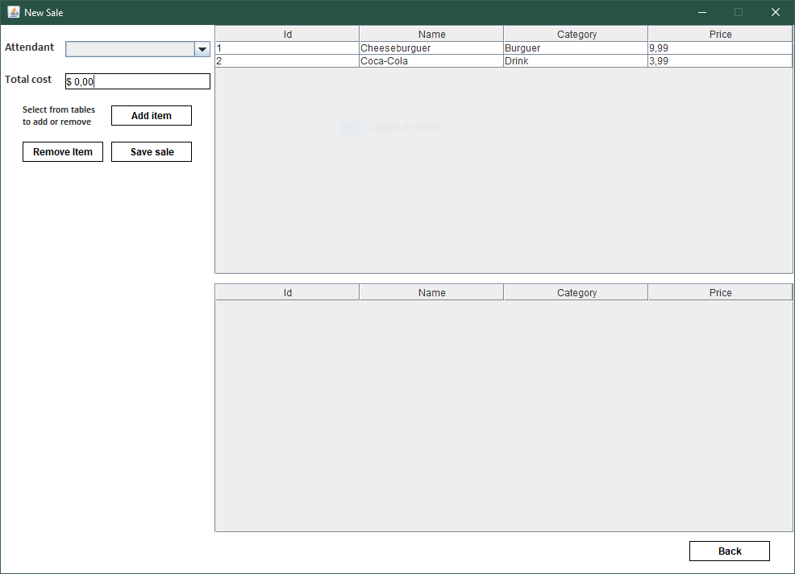
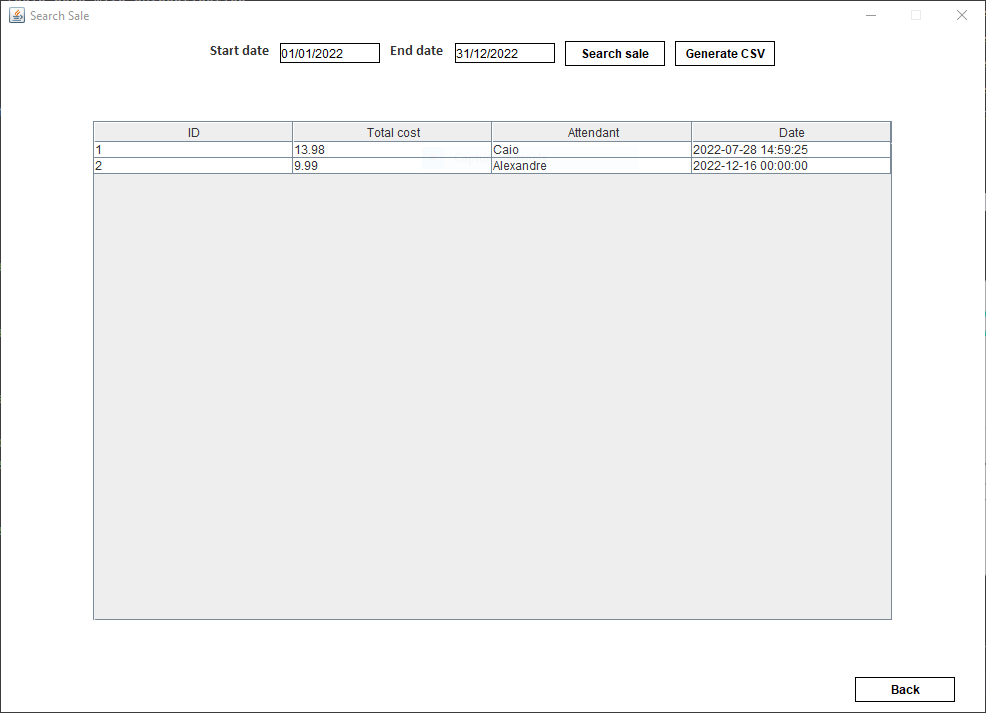

# Java Swing Store Management App
## An application for managing the users and products in a store
## Java Project Unit Testing using JUnit

---

The aim for this project is to gets a hands-on experience in Testing Java Applications using JUnit, a Unit testing framework.

A SQLite database is used for this application.

The following list is a summary of the complete and incomplete features of this Java Swing Application.

- [x] Create a GUI base with the Swing library/framework
- [x] Integrate the SQLite database into the project
- [x] Create the login page with authentication
- [x] Create the menu page
- [x] Create the manager's pages
- [x] Create the 'new sale' page
- [x] Create the 'search sale' page
- [ ] Create settings int the menu for the user to tweak

---

## Screenshots

### Login

### Menu

### Manage users

### Manage products

### New sale

### Search sale

